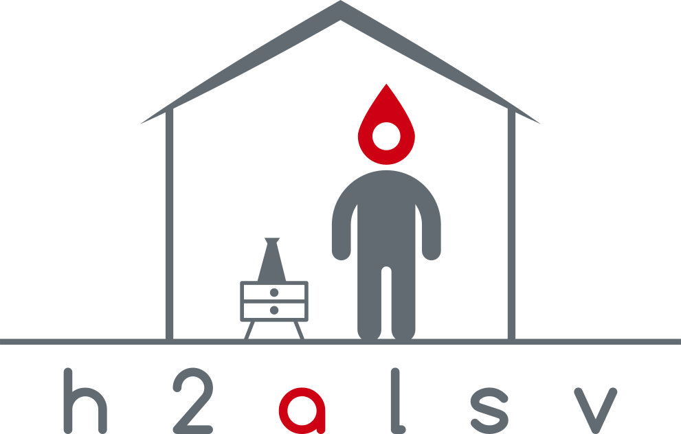

  

    <h1>
      
       
      Human Health and Activity Lab Sensor Visualization
    </h1>
     
  

Real-time Visualization of Sensor Data in the Human Health and Activity Lab at
Lulea University of Technology.

This project is developed as part of the D0020E course at LTU.

The Human Health and Activity Laboratory is a new research facility implemented
in 2018 at LTU. It is a smart home environment with numerous different sensors.
The goal is to create a modular system that collects and visualizes data from
different sensors in real-time. This repository contains different modules
that produce and consume data. The system is designed to be highly modular and
easy to expand. All sensor data is routed through a central message broker from
which data from all different sensors can be accessed.

A more in-depth look at the Human Health and Activity Lab can be found in
[this](http://ltu.diva-portal.org/smash/record.jsf?pid=diva2:1290940) paper.

## Sensor Support

Currently the planned sensor support is

* Vayyar
* WideFind
* Z-wave (Kitchen Cabinets)

## Modules

This repository currently contains the following producer and consumer modules:

### Producers
* Vayyar
* WideFind
* Z-Wave

### Consumers
* Websocket Server
* React Web UI
* MySQL Data Aggregator

