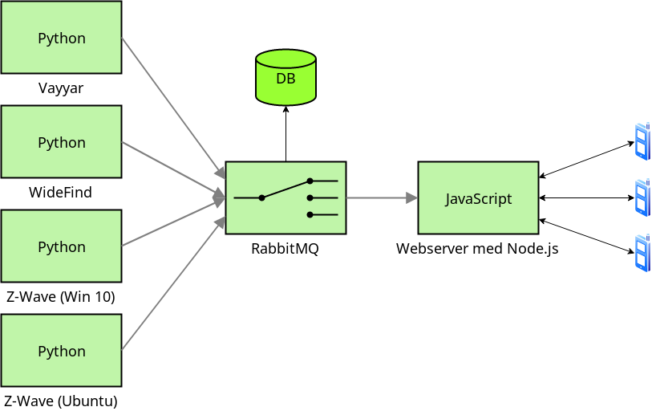

# Introduction

## General Practices

The modules are all asynchronous and non-blocking. The sensor modules written
in python are all `asyncio` based. All modules use separate configuration files
written in TOML. 

## Git Workflow

The `develop` branch should be considered the main branch. `master` will only
be used for tested releases. When implementing a new feature make a new local
feature branch off of `develop`. When the feature is completed please rebase or
merge the changes onto the `develop` branch. Then push your changes to GitHub.
Please do not push to `master`. Do not merge `develop`onto `master` unless the
current develop commit has been thouroughly tested and documented.

All documentation should preferably be commited together with the featured code. 
No code will be accepted without proper documentation.

## System Design

The overall system design is based on microservices connected through a
RabbitMQ message broker. Each sensor has its own producer module. The producers
sends collected sensor data to the RMQ server.

The consumers visualize the data from the different sensors. From the Web UI it
is possible to view the data sent from each sensor. Each sensor also sends a
continous heartbeat to confirm connection to RMQ. The status of each sensor
module is visible from the Web UI. It should be simple for a user to view the
status of the entire system. All module logs are saved in a central database.

The figure below shows a graphical representation of the overall design.

